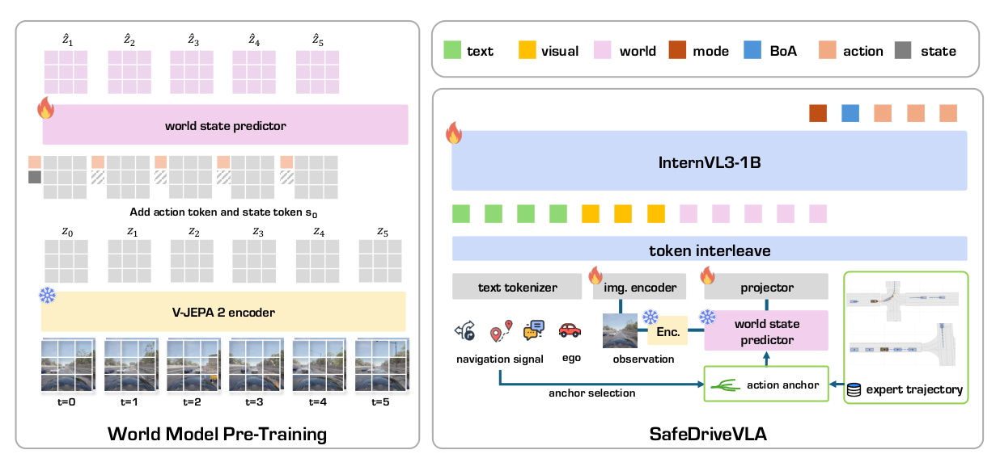

<h1 align="center">🤖 RoboWorld 2026 Track 3: SafeDrive-VLA<br>Towards Safety in Autonomous Driving</h1>

<div align="center" markdown="1">

**Official Track Documentation for [Track 3](https://roboworld2026.github.io/track3)**

*Built on the SafeDriveVLA benchmarks (CARLA-F and B2D-C) — "SafeDriveVLA: Navigation-Conditioned World Model Dreaming for Conflict-Aware End-to-End Autonomous Driving"*<br>([SafeDriveVLA repository](https://github.com/Daniel-xsy/safedrive-vla) | [Project page](https://safedrive-vla.github.io/SafeDriveVLA/) | [Training data](https://huggingface.co/datasets/RenzKa/simlingo))

[](https://roboworld2026.github.io/)
[](https://roboworld2026.github.io/track3)
[](https://robotpad2026.github.io/)
[](https://www.codabench.org/competitions/18333/)
[](https://safedrive-vla.github.io/SafeDriveVLA/)
[](https://github.com/Daniel-xsy/safedrive-vla)

**🏆 Awards: Official Certificates for Top 5 Teams & NeurIPS 2026 RoboPAD Workshop Oral Presentations**

</div>

## 🌍 Challenge Overview

**SafeDrive-VLA** invites participants to develop **vision-language-action models (VLAs)** for **safe navigation guided by natural-language instructions**. Given onboard visual observations and an instruction, models generate driving trajectories or control actions that account for surrounding traffic conditions.

Models should **follow safe instructions**, including turns, lane changes, and target-speed requests. When an instruction **conflicts with the traffic scene**, models must respond appropriately by slowing down, waiting, or selecting a safe alternative. End-to-end policies, VLA models, world-model approaches, explicit conflict reasoning, and reinforcement learning are all welcome.

### 🎯 Task Definition

| Component | Description |
|:--|:--|
| **Input** | Onboard visual observations and a stream of natural-language navigation instructions. Language is the only navigation signal; route-planner commands and target waypoints are withheld from the agent. |
| **Output** | Driving trajectories or control actions. |
| **Setting** | Closed-loop, safety-aware driving in the CARLA simulator. |
| **Objective** | Execute safe instructions faithfully, and respond safely when an instruction conflicts with the traffic scene. |
| **Evaluation** | The organizers run each submitted agent in closed loop on withheld CARLA-F and B2D-C routes. |

## 📅 Competition Details

- **Event:** [RoboWorld Challenge 2026, Track 3](https://roboworld2026.github.io/track3), affiliated with the [RoboPAD Workshop at NeurIPS 2026](https://robotpad2026.github.io/).
- **Registration:** register through the [Google Form](https://roboworld2026.github.io/#registration) (registration opens October 08, 2026) to be eligible for the leaderboard, certificates, and awards.
- **Submission platform:** [CodaBench — SafeDrive-VLA](https://www.codabench.org/competitions/18333/).
- **Submission limits:** every submission is evaluated in closed loop by the organizers, so at most one submission per day and ten in total are allowed.

### 🗓️ Timeline

| Event | Date |
|:--|:--|
| Registration opens | October 08, 2026 (via [Google Form](https://roboworld2026.github.io/#registration)) |
| Training data, baselines & servers online (Final Evaluation opens) | October 15, 2026 |
| Final submission deadline | November 30, 2026 |
| Award decision announcement | December 12, 2026 (RoboPAD Workshop @ NeurIPS 2026) |

*Phase boundaries on CodaBench follow UTC+8. Follow the [competition page](https://www.codabench.org/competitions/18333/) and [track website](https://roboworld2026.github.io/track3) for any updates.*

### 🗂️ Phases

| Phase | Duration | Evaluation data | Leaderboard role |
|:--|:--|:--|:--|
| **Final Evaluation** | Oct 15 – Nov 30, 2026 | 40 withheld closed-loop routes (20 CARLA-F + 20 B2D-C) | Determines final ranking and awards. |

The challenge has a single phase.

### 🏆 Awards & Recognition

Official challenge awards are aligned with the [RoboWorld 2026 Awards & Recognition](https://roboworld2026.github.io/#awards) guidelines:

| Recognition | Description |
|:--|:--|
| 📜 **Certificates of Recognition** | Official certificates awarded to the **Top 5 teams** in Track 3 |
| 💡 **Best Innovative Solution** | Certificate recognizing outstanding creativity and technical innovation |
| 🎤 **Oral Presentations** | Selected top-performing teams will be invited to give oral presentations at the **RoboPAD Workshop @ NeurIPS 2026** |

## 📊 Dataset

### Evaluation Routes

Evaluation consists of **40 closed-loop simulation routes** across two complementary test sets:

| Test set | Routes | Details |
|:--|--:|:--|
| **CARLA-F** | 20 | Safe instruction following |
| **B2D-C** | 20 | Conflicting instructions issued when hazards occur |
| **Total** | **40** | |

- **CARLA-F (safe instruction following):** chained language instructions for turn left, turn right, go straight, lane change left, lane change right, lane follow, and target speed, on routes rebuilt from the CARLA road topology. Background traffic is disabled and traffic lights are forced green, so every instruction is safe and expected to be executed.
- **B2D-C (instruction-scene conflict):** unsafe natural-language instructions are issued at the safety-critical events of Bench2Drive scenarios, such as pedestrian crossings, cut-ins from parked lanes, and blocked intersections. Danger is contextual: the same instruction could be safe in a different scene, so the agent must reason about the instruction relative to its current observation.

The competition routes are generated with the same protocols as the public benchmarks, withheld from participants, and used only for official evaluation. The full public CARLA-F (210 routes) and B2D-C (150 routes) benchmarks from the SafeDriveVLA paper can be used for local development.

### Training Data

Training uses the CARLA driving dataset that [SimLingo](https://github.com/RenzKa/simlingo) (CVPR 2025) collected with [PDM-Lite](https://github.com/OpenDriveLab/DriveLM/tree/DriveLM-CARLA/pdm_lite), a privileged rule-based expert. The dataset is released on Hugging Face as [RenzKa/simlingo](https://huggingface.co/datasets/RenzKa/simlingo).

- **Scale:** 3,308,315 samples recorded at 4 fps, distributed as about 1.2 TB of compressed archives. Samples are not from unique routes, because the available CARLA route files are limited.
- **Routes and scenarios:** routes come from Towns 1–10 and from the official CARLA Leaderboard 2.0 routes in Towns 12 and 13. All are short routes with one scenario (62.1%) or three scenarios (37.9%), driven under random weather. They cover 38 complex scenarios, including urban traffic, participants violating traffic rules, and high-speed highway driving.
- **Language annotations:** commentary that explains driving decisions; instruction-following ("Dreamer") data with multiple alternative instruction–action pairs per sample, each labeled with whether the instructed action is safe to execute and, if not, why; and VQA based on DriveLM.
- **Use in the reference baseline:** SafeDriveVLA uses the driving frames and measurements, the instruction-following data, and the scenario buckets for balanced sampling; it does not use the commentary or VQA annotations.

## 🚀 Getting Started

### 1. Download and Prepare the Data

*To be announced soon.*

### 2. Set Up a Baseline

Clone the SafeDriveVLA implementation:

```bash
git clone https://github.com/Daniel-xsy/safedrive-vla.git
cd safedrive-vla
```

The [SafeDriveVLA repository](https://github.com/Daniel-xsy/safedrive-vla) provides world-model pre-training, VLA training, and closed-loop evaluation code for CARLA-F and B2D-C, together with the benchmark route files. Follow its [installation guide](https://github.com/Daniel-xsy/safedrive-vla/blob/main/docs/install.md) for the environment setup.

### 3. Prepare a Submission

*To be announced soon.* See [Submission Format](#-submission-format).

## 🧠 Baseline Models

Two reference baselines generate driving actions from visual observations and language instructions:

| Baseline | Approach |
|:--|:--|
| **SimLingo** | A vision-only closed-loop driving model with language-action alignment that maps camera observations and language instructions to driving actions. |
| **SafeDriveVLA** | Additionally uses explicit driving-mode selection and world-model predictions to handle conflicts between instructions and the traffic scene. |

<p align="center">
  
</p>

SafeDriveVLA decouples conflict reasoning from action generation:

- **Driving mode.** Every expert frame is relabeled with a discrete driving mode (strict, cautious, or fallback) that states whether the trajectory executes, cautiously follows, or overrides the navigation signal. The model emits this mode token before its actions, so conflict awareness is supervised directly.
- **Navigation-conditioned world-model dreaming.** A frozen latent world model, a V-JEPA 2 encoder with an action-conditioned predictor, rolls the scene forward under the action anchor of the instructed maneuver. The policy reads these predicted world tokens and can see whether the maneuver is feasible before it commits.

The SafeDriveVLA policy builds on InternVL3-1B, emits discrete action tokens from a 2,048-entry motion-primitive codebook, and uses a lightweight path head for lateral control. Implementations are provided in the [SafeDriveVLA repository](https://github.com/Daniel-xsy/safedrive-vla).

Reference results reported in the [SafeDriveVLA paper](https://safedrive-vla.github.io/SafeDriveVLA/) on the full public benchmark routes are shown below. These are baseline results, not competition submissions.

**CARLA-F** (Navigation Compliance Rate per meta-command, %)

| Baseline | Speed Error ↓ | Turn left | Turn right | Go straight | Left lane | Right lane | Lane follow | Avg. ↑ |
|:--|--:|--:|--:|--:|--:|--:|--:|--:|
| SimLingo | 1.44 | 83.6 | 80.4 | 45.9 | 0.0 | 0.0 | 63.8 | 52.4 |
| SimLingo-IF | **1.31** | 89.1 | 82.3 | 49.4 | 0.0 | 0.0 | 69.0 | 55.6 |
| SimLingo-Safe | 1.67 | **92.7** | 84.3 | 50.6 | 0.0 | 0.0 | 62.1 | 55.6 |
| **SafeDriveVLA** | 4.28 | **92.7** | **90.2** | **84.7** | **63.6** | **72.4** | **81.0** | **83.0** |

Avg. is weighted by the number of instructions per meta-command and excludes speed. Speed Error is in m/s.

**B2D-C**

| Baseline | DS ↑ | SR (%) ↑ | Collision ↓ | Traffic Violation ↓ | Out of Route ↓ |
|:--|--:|--:|--:|--:|--:|
| SimLingo | 72.8 | 36.7 | 66 | 60 | 18 |
| SimLingo-IF | 56.3 | 12.7 | 166 | 57 | 32 |
| SimLingo-Safe | 72.8 | 38.0 | 60 | 61 | 11 |
| **SafeDriveVLA** | **85.9** | **67.3** | **38** | **9** | **4** |

All baselines receive natural-language instructions as the only navigation signal. SimLingo denotes its default commentary mode, while SimLingo-IF and SimLingo-Safe prepend the `<INSTRUCTION_FOLLOWING>` and `<SAFETY>` tags, respectively, to the prompt of the same checkpoint. The two test sets measure different aspects of performance: (1) instruction following in safe scenarios and (2) awareness of unsafe instructions. SafeDriveVLA is trained on the full PDM-Lite data; see the [SafeDriveVLA repository](https://github.com/Daniel-xsy/safedrive-vla#main-results) for command-based baselines and Bench2Drive results.

## 📏 Evaluation

**CARLA-F** evaluates safe instruction following using the per-instruction Navigation Compliance Rate (NCR) and target-speed error. **B2D-C** evaluates safety-critical driving using Driving Score (DS), Success Rate (SR), and counts of collisions, traffic violations, and route departures. Results from the two test sets are reported separately.

| Test set | Metric | Direction | Description |
|:--|:--|:--|:--|
| CARLA-F | **Navigation Compliance Rate (NCR)** | Higher is better | Per-instruction navigation compliance. |
| CARLA-F | **Speed Error (SE)** | Lower is better | Deviation from the instructed target speed, in m/s. |
| B2D-C | **Driving Score (DS)** | Higher is better | Closed-loop driving performance. |
| B2D-C | **Success Rate (SR)** | Higher is better | Route success. |
| B2D-C | **Collisions, traffic violations, route departures** | Lower is better | Counts of safety and route-following failures. |

### 🏁 Ranking Rule

*To be announced soon.*

## 📥 Submission Format

*To be announced soon.* Submission instructions and the full evaluation protocol, including agent packaging, simulation versions, runtime requirements, and the final ranking rule, will be published here and on the [CodaBench Submission & Evaluation page](https://www.codabench.org/competitions/18333/).

## ❓ Frequently Asked Questions

**1. Do I have to use a world model or the SafeDriveVLA architecture?**

No. End-to-end policies, VLA models, world-model approaches, explicit conflict reasoning, and reinforcement learning are all welcome.

**2. Which navigation signal does the agent receive?**

Natural-language instructions only. Route-planner commands, target waypoints, route polylines, scenario definitions, and privileged simulator state are withheld from the agent.

**3. Can I use the public CARLA-F and B2D-C routes?**

Yes, the full public benchmarks can be used for local development. The 40 competition routes are generated with the same protocols but are withheld and used only for official evaluation.

**4. Why are submissions limited to one per day?**

Every submission is evaluated in closed loop in CARLA by the organizers, so at most one submission per day and ten in total are allowed.

## 🔗 Contact and Resources

For technical support, use [GitHub Issues](https://github.com/roboworld2026/track3/issues). For challenge questions, contact [roboworld2026@gmail.com](mailto:roboworld2026@gmail.com). A Track 3 WeChat group is listed on the [challenge website](https://roboworld2026.github.io/).

| Resource | Link |
|:--|:--|
| Official Track 3 Website | [RoboWorld 2026 Track 3: SafeDrive-VLA](https://roboworld2026.github.io/track3) |
| Official Challenge Portal & Registration | [RoboWorld 2026 Registration (Google Form)](https://roboworld2026.github.io/#registration) |
| Official Awards & Recognition | [RoboWorld 2026 Awards](https://roboworld2026.github.io/#awards) |
| Track 1 (WorldNav) Website | [RoboWorld 2026 Track 1: WorldNav](https://roboworld2026.github.io/track1) |
| Track 2 (HA-VLN 2.0) Website | [RoboWorld 2026 Track 2: HA-VLN 2.0](https://roboworld2026.github.io/track2) |
| Associated Workshop | [RoboPAD at NeurIPS 2026](https://robotpad2026.github.io/) |
| CodaBench Competition Portal | [CodaBench #18333](https://www.codabench.org/competitions/18333/) |
| GitHub Repository | [roboworld2026/track3](https://github.com/roboworld2026/track3) |
| Baseline implementation | [SafeDriveVLA repository](https://github.com/Daniel-xsy/safedrive-vla) |
| Paper | [SafeDriveVLA: Navigation-Conditioned World Model Dreaming for Conflict-Aware End-to-End Autonomous Driving](https://safedrive-vla.github.io/SafeDriveVLA/) |
| Training data | [RenzKa/simlingo on Hugging Face](https://huggingface.co/datasets/RenzKa/simlingo) |
| SimLingo | [Official repository](https://github.com/RenzKa/simlingo) |
| Simulation | [CARLA](https://carla.org/) and [Bench2Drive](https://github.com/Thinklab-SJTU/Bench2Drive) |

## 📄 License and Terms

CARLA, Bench2Drive, SimLingo and its dataset, PDM-Lite, the SafeDriveVLA code and benchmarks, and all other resources retain their upstream licenses. Participation is governed by the Track 3 Terms and Conditions on [CodaBench](https://www.codabench.org/competitions/18333/).

## 📚 Citation

If you use the SafeDriveVLA benchmarks or the SafeDrive-VLA track resources, please cite:

```bibtex
@inproceedings{xie2026safedrivevla,
  title     = {SafeDriveVLA: Navigation-Conditioned World Model Dreaming for Conflict-Aware End-to-End Autonomous Driving},
  author    = {Xie, Shaoyuan and Zhang, Zihan and Wang, Jingxuan and Qu, Jiashu and Liang, Xiaoqing and Kong, Lingdong and Lu, Junchi and Christensen, Henrik I. and Chen, Qi Alfred},
  booktitle = {Conference on Robot Learning (CoRL)},
  year      = {2026}
}

@misc{roboworld2026track3,
  title={Track 3 | SafeDrive-VLA: Towards Safety in Autonomous Driving},
  author={RoboWorld Challenge 2026 Organizers},
  year={2026},
  howpublished={https://roboworld2026.github.io/track3}
}
```

## 🤝 Acknowledgements

SafeDrive-VLA is organized by the RoboWorld Challenge 2026 team as part of an independently organized challenge associated with the [RoboPAD Workshop at NeurIPS 2026](https://robotpad2026.github.io/). We thank the SimLingo authors for the released training data, the PDM-Lite, CARLA, and Bench2Drive teams, and CodaBench for the evaluation infrastructure.
